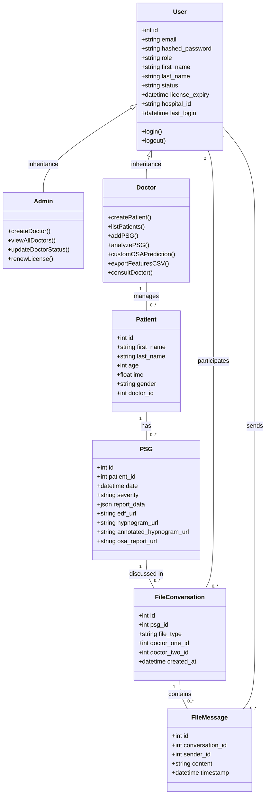

# Class Diagram - BioVant (Hypnoria)

```mermaid
classDiagram
    class User {
        +int id
        +string email
        +string hashed_password
        +string role
        +string first_name
        +string last_name
        +string status
        +datetime license_expiry
        +string hospital_id
        +datetime last_login
        +login()
        +logout()
    }

    class Admin {
        +createDoctor()
        +viewAllDoctors()
        +updateDoctorStatus()
        +renewLicense()
    }

    class Doctor {
        +createPatient()
        +listPatients()
        +addPSG()
        +analyzePSG()
        +customOSAPrediction()
        +exportFeaturesCSV()
        +consultDoctor()
    }

    class Patient {
        +int id
        +string first_name
        +string last_name
        +int age
        +float imc
        +string gender
        +int doctor_id
    }

    class PSG {
        +int id
        +int patient_id
        +datetime date
        +string severity
        +json report_data
        +string edf_url
        +string hypnogram_url
        +string annotated_hypnogram_url
        +string osa_report_url
    }

    class FileConversation {
        +int id
        +int psg_id
        +string file_type
        +int doctor_one_id
        +int doctor_two_id
        +datetime created_at
    }

    class FileMessage {
        +int id
        +int conversation_id
        +int sender_id
        +string content
        +datetime timestamp
    }

    User <|-- Admin : inheritance
    User <|-- Doctor : inheritance
    Doctor "1" -- "0..*" Patient : manages
    Patient "1" -- "0..*" PSG : has
    PSG "1" -- "0..*" FileConversation : discussed in
    FileConversation "1" -- "0..*" FileMessage : contains
    User "1" -- "0..*" FileMessage : sends
    User "2" -- "0..*" FileConversation : participates
```
