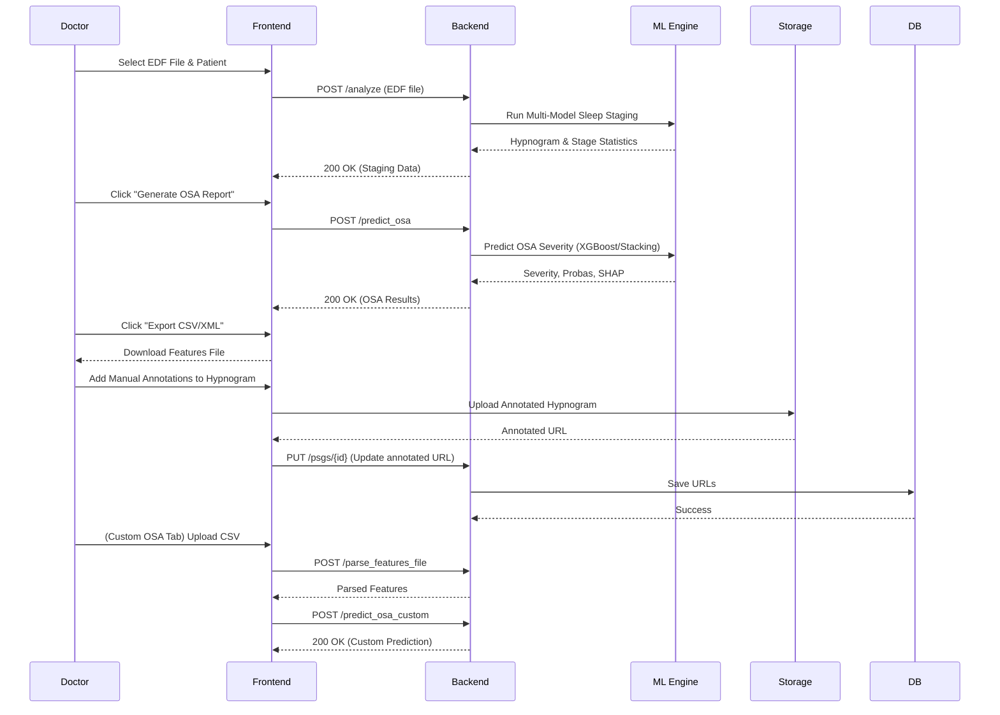

# Sequence Diagram: PSG Upload, Analysis & Custom OSA

```mermaid
sequenceDiagram
    participant Doctor
    participant Frontend
    participant Backend
    participant ML as ML Engine
    participant S3 as Storage
    participant DB

    Doctor->>Frontend: Select EDF File & Patient
    Frontend->>Backend: POST /analyze (EDF file)
    Backend->>ML: Run Multi-Model Sleep Staging
    ML-->>Backend: Hypnogram & Stage Statistics
    Backend-->>Frontend: 200 OK (Staging Data)
    
    Doctor->>Frontend: Click "Generate OSA Report"
    Frontend->>Backend: POST /predict_osa
    Backend->>ML: Predict OSA Severity (XGBoost/Stacking)
    ML-->>Backend: Severity, Probas, SHAP
    Backend-->>Frontend: 200 OK (OSA Results)
    
    Doctor->>Frontend: Click "Export CSV/XML"
    Frontend-->>Doctor: Download Features File

    Doctor->>Frontend: Add Manual Annotations to Hypnogram
    Frontend->>S3: Upload Annotated Hypnogram
    S3-->>Frontend: Annotated URL
    Frontend->>Backend: PUT /psgs/{id} (Update annotated URL)
    Backend->>DB: Save URLs
    DB-->>Backend: Success
    
    Doctor->>Frontend: (Custom OSA Tab) Upload CSV
    Frontend->>Backend: POST /parse_features_file
    Backend-->>Frontend: Parsed Features
    Frontend->>Backend: POST /predict_osa_custom
    Backend-->>Frontend: 200 OK (Custom Prediction)
```
