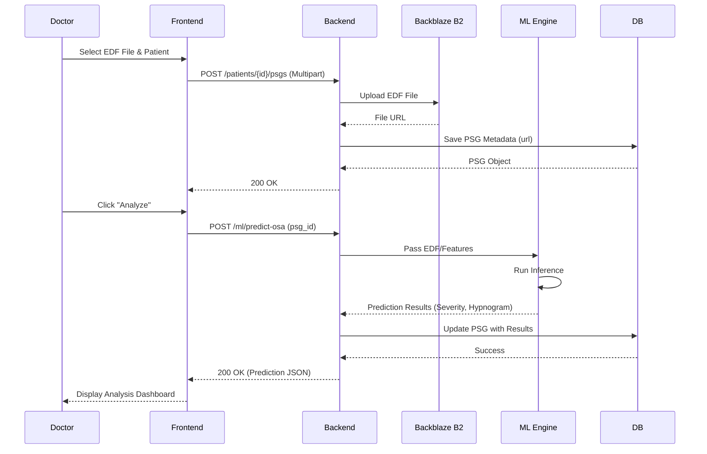

# Sequence Diagram: PSG Upload & Analysis

```mermaid
sequenceDiagram
    participant Doctor
    participant Frontend
    participant Backend
    participant B2 as Backblaze B2
    participant ML as ML Engine
    participant DB

    Doctor->>Frontend: Select EDF File & Patient
    Frontend->>Backend: POST /patients/{id}/psgs (Multipart)
    Backend->>B2: Upload EDF File
    B2-->>Backend: File URL
    Backend->>DB: Save PSG Metadata (url)
    DB-->>Backend: PSG Object
    Backend-->>Frontend: 200 OK
    
    Doctor->>Frontend: Click "Analyze"
    Frontend->>Backend: POST /ml/predict-osa (psg_id)
    Backend->>ML: Pass EDF/Features
    ML->>ML: Run Inference
    ML-->>Backend: Prediction Results (Severity, Hypnogram)
    Backend->>DB: Update PSG with Results
    DB-->>Backend: Success
    Backend-->>Frontend: 200 OK (Prediction JSON)
    Frontend-->>Doctor: Display Analysis Dashboard
```
