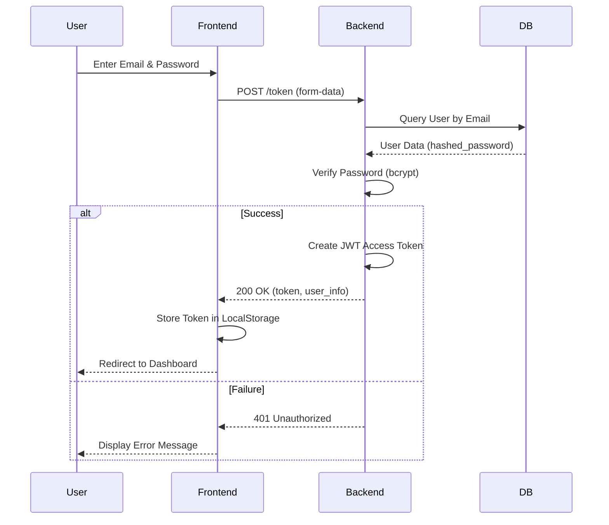

# Sequence Diagram: Authentication (Login)

```mermaid
sequenceDiagram
    participant User
    participant Frontend
    participant Backend
    participant DB

    User->>Frontend: Enter Email & Password
    Frontend->>Backend: POST /token (form-data)
    Backend->>DB: Query User by Email
    DB-->>Backend: User Data (hashed_password)
    Backend->>Backend: Verify Password (bcrypt)
    alt Success
        Backend->>Backend: Create JWT Access Token
        Backend-->>Frontend: 200 OK (token, user_info)
        Frontend->>Frontend: Store Token in LocalStorage
        Frontend-->>User: Redirect to Dashboard
    else Failure
        Backend-->>Frontend: 401 Unauthorized
        Frontend-->>User: Display Error Message
    end
```
