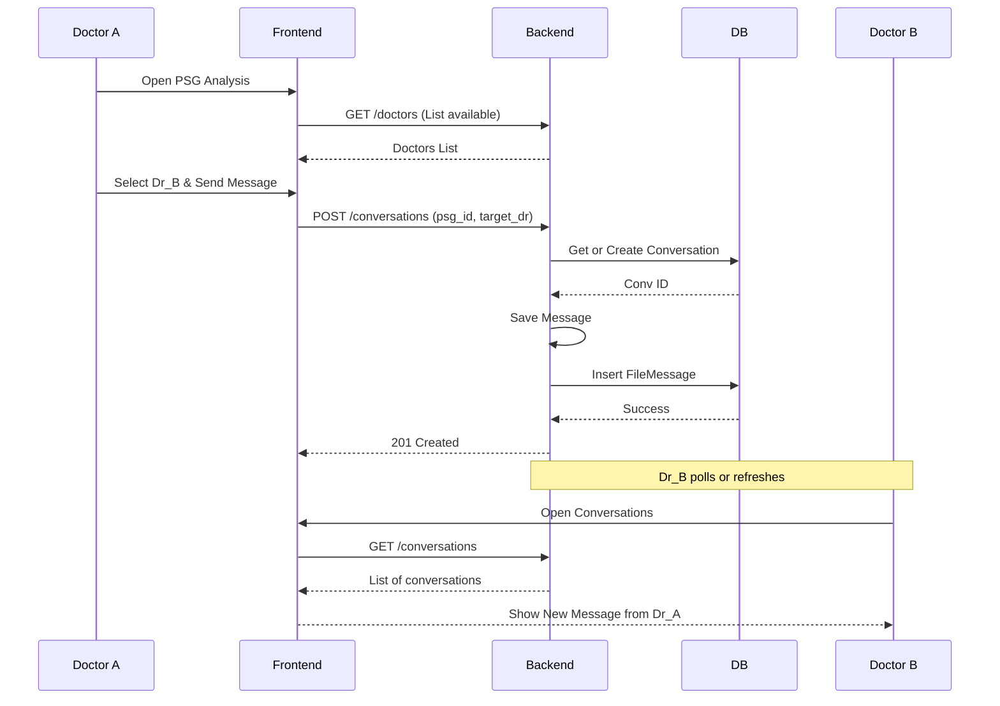

# Sequence Diagram: Inter-Doctor Consultation (Chat)

```mermaid
sequenceDiagram
    participant Dr_A as Doctor A
    participant Frontend
    participant Backend
    participant DB
    participant Dr_B as Doctor B

    Dr_A->>Frontend: Open PSG Analysis
    Frontend->>Backend: GET /doctors (List available)
    Backend-->>Frontend: Doctors List
    Dr_A->>Frontend: Select Dr_B & Send Message
    Frontend->>Backend: POST /conversations (psg_id, target_dr)
    Backend->>DB: Get or Create Conversation
    DB-->>Backend: Conv ID
    Backend->>Backend: Save Message
    Backend->>DB: Insert FileMessage
    DB-->>Backend: Success
    Backend-->>Frontend: 201 Created
    
    Note over Dr_B, Backend: Dr_B polls or refreshes
    Dr_B->>Frontend: Open Conversations
    Frontend->>Backend: GET /conversations
    Backend-->>Frontend: List of conversations
    Frontend-->>Dr_B: Show New Message from Dr_A
```
