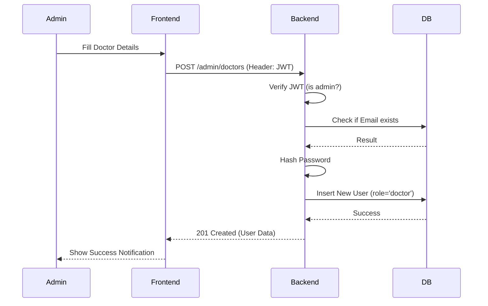

# Sequence Diagram: Doctor Creation (Admin)

```mermaid
sequenceDiagram
    participant Admin
    participant Frontend
    participant Backend
    participant DB

    Admin->>Frontend: Fill Doctor Details
    Frontend->>Backend: POST /admin/doctors (Header: JWT)
    Backend->>Backend: Verify JWT (is admin?)
    Backend->>DB: Check if Email exists
    DB-->>Backend: Result
    Backend->>Backend: Hash Password
    Backend->>DB: Insert New User (role='doctor')
    DB-->>Backend: Success
    Backend-->>Frontend: 201 Created (User Data)
    Frontend-->>Admin: Show Success Notification
```
