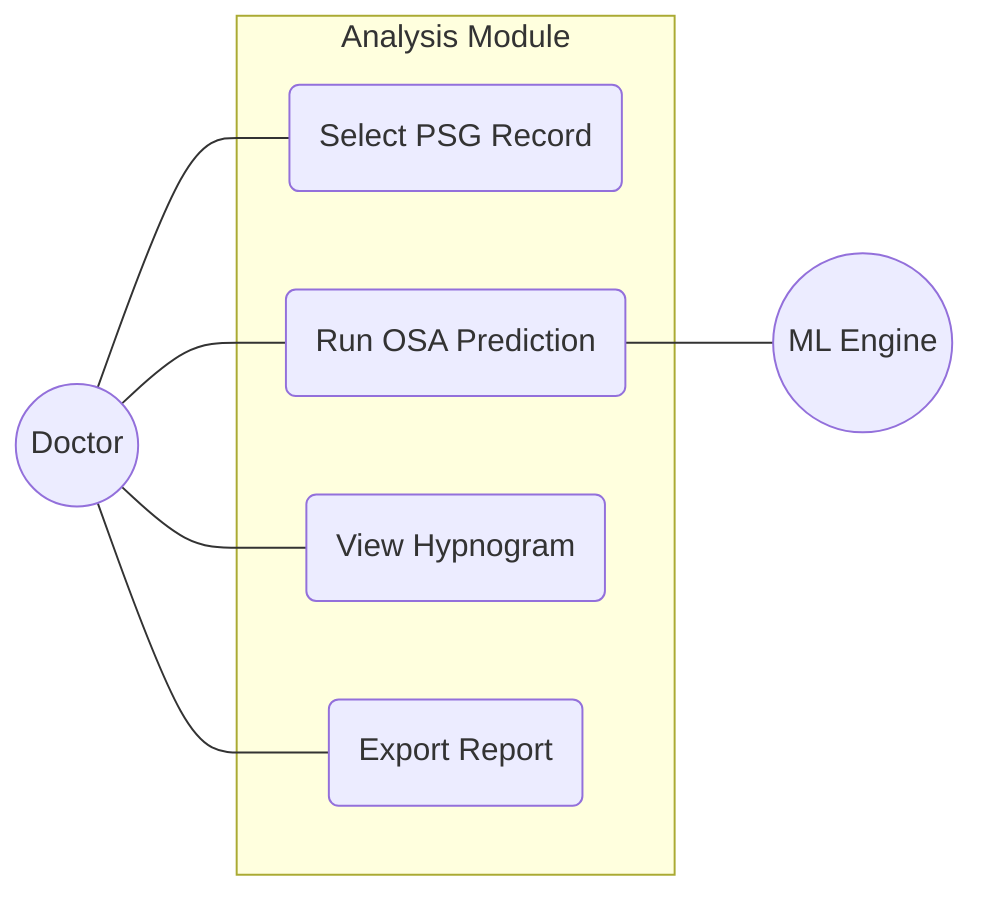

# Use Case: Sleep Analysis & OSA Prediction

```mermaid
graph LR
    Doctor((Doctor))
    ML_Engine((ML Engine))

    subgraph Analysis_Module [Analysis Module]
        UC1(Select PSG Record)
        UC2(Run OSA Prediction)
        UC3(View Hypnogram)
        UC4(Export Report)
    end

    Doctor --- UC1
    Doctor --- UC2
    Doctor --- UC3
    Doctor --- UC4
    UC2 --- ML_Engine
```
