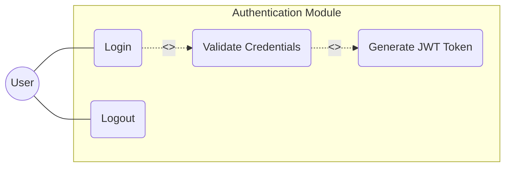

# Use Case: Authentication

```mermaid
graph LR
    User((User))

    subgraph Authentication_Module [Authentication Module]
        UC1(Login)
        UC2(Validate Credentials)
        UC3(Generate JWT Token)
        UC4(Logout)
    end

    User --- UC1
    User --- UC4
    UC1 -. "<<include>>" .-> UC2
    UC2 -. "<<include>>" .-> UC3
```
