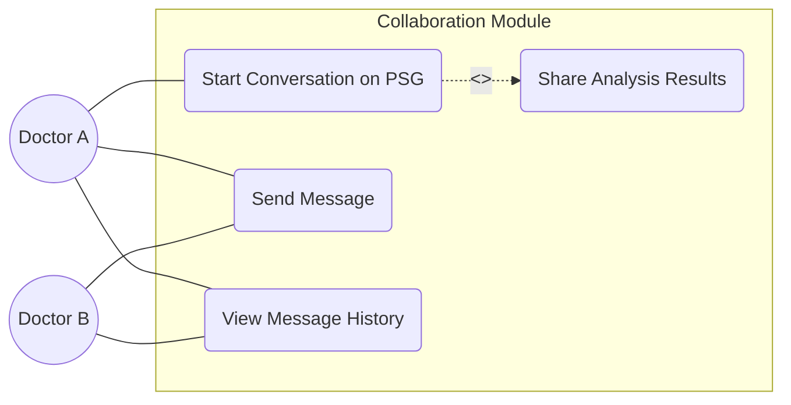

# Use Case: Inter-Doctor Consultation (Chat)

```mermaid
graph LR
    DrA((Doctor A))
    DrB((Doctor B))

    subgraph Collaboration_Module [Collaboration Module]
        UC1(Start Conversation on PSG)
        UC2(Send Message)
        UC3(View Message History)
        UC4(Share Analysis Results)
    end

    DrA --- UC1
    DrA --- UC2
    DrA --- UC3
    DrB --- UC2
    DrB --- UC3
    UC1 -. "<<extend>>" .-> UC4
```
