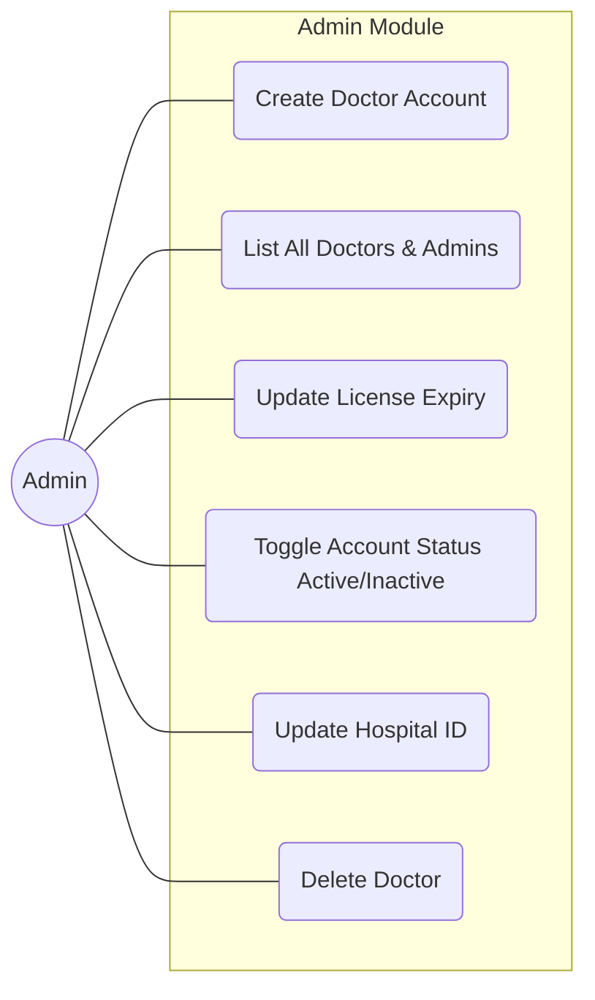

# Use Case: Doctor Management (Admin)

```mermaid
graph LR
    Admin((Admin))

    subgraph Admin_Module [Admin Module]
        UC1(Create Doctor Account)
        UC2(List All Doctors & Admins)
        UC3(Update License Expiry)
        UC4(Toggle Account Status Active/Inactive)
        UC5(Update Hospital ID)
        UC6(Delete Doctor)
    end

    Admin --- UC1
    Admin --- UC2
    Admin --- UC3
    Admin --- UC4
    Admin --- UC5
    Admin --- UC6
```
