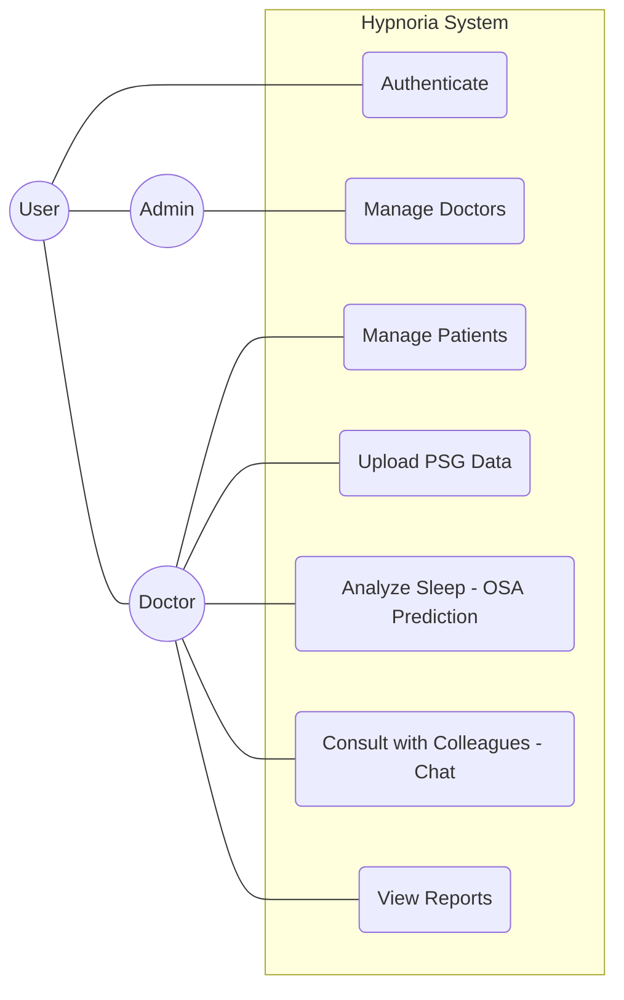

# Global Use Case Diagram - BioVant

```mermaid
graph LR
    %% Actors
    Admin((Admin))
    Doctor((Doctor))
    User((User))

    %% Relationships
    User --- Admin
    User --- Doctor

    subgraph Hypnoria_System [Hypnoria System]
        UC1(Authenticate)
        UC2(Manage Doctors)
        UC3(Manage Patients)
        UC4(Upload PSG Data)
        UC5(Analyze Sleep - OSA Prediction)
        UC6(Consult with Colleagues - Chat)
        UC7(View Reports)
    end

    %% Links
    User --- UC1
    Admin --- UC2
    Doctor --- UC3
    Doctor --- UC4
    Doctor --- UC5
    Doctor --- UC6
    Doctor --- UC7
```
