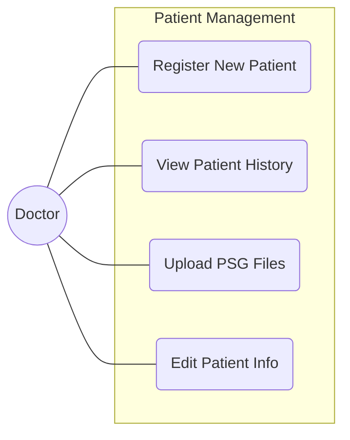

# Use Case: Patient & PSG Management (Doctor)

```mermaid
graph LR
    Doctor((Doctor))

    subgraph Patient_Management [Patient Management]
        UC1(Register New Patient)
        UC2(View Patient History)
        UC3(Upload PSG Files)
        UC4(Edit Patient Info)
    end

    Doctor --- UC1
    Doctor --- UC2
    Doctor --- UC3
    Doctor --- UC4
```
